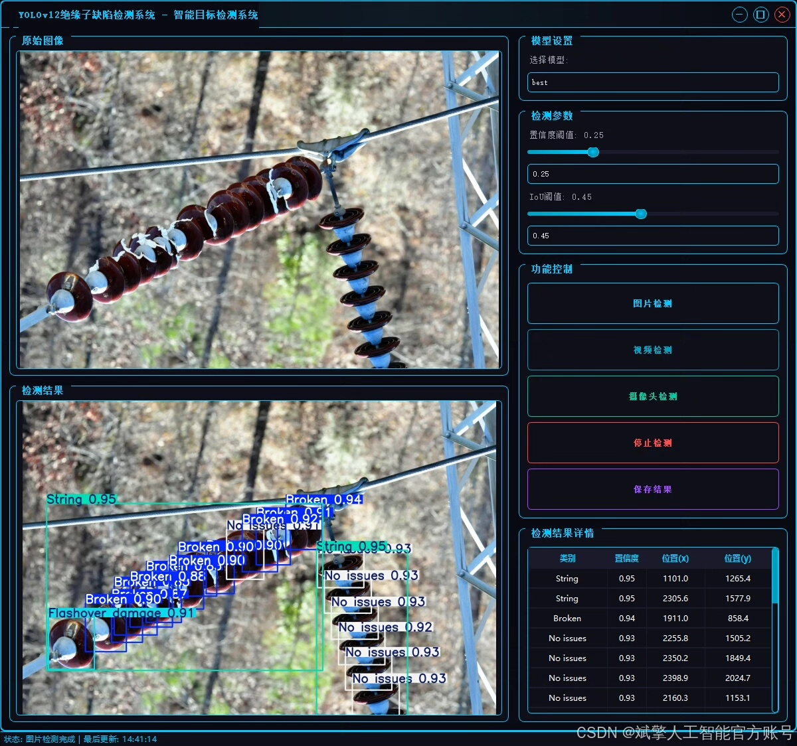
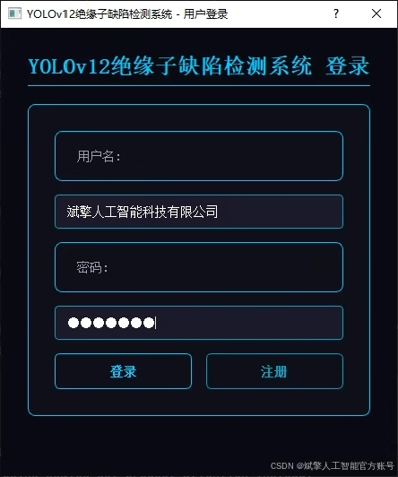
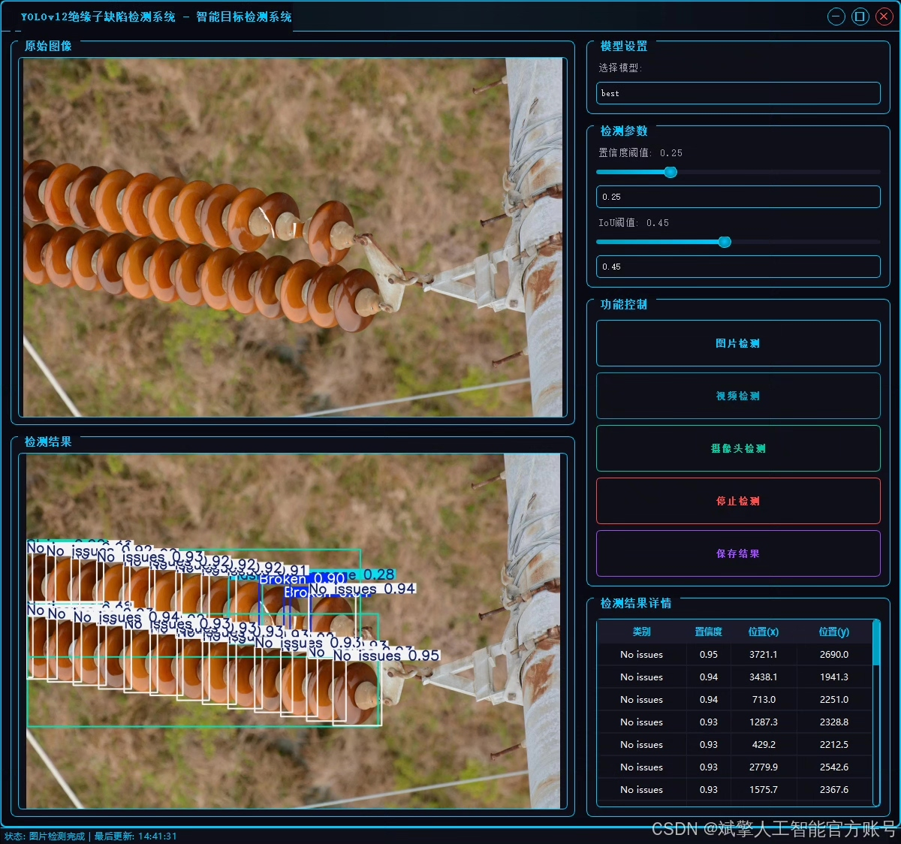
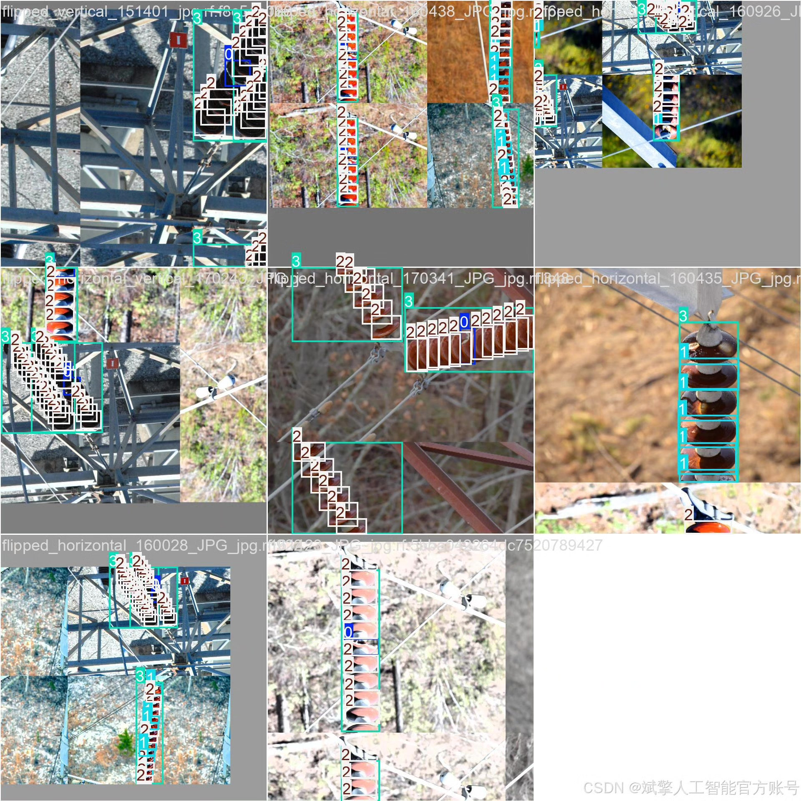
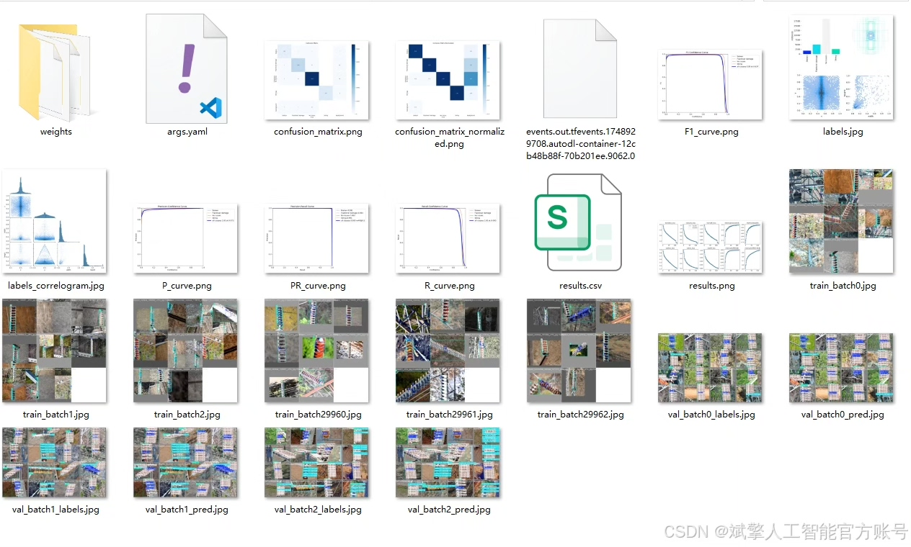
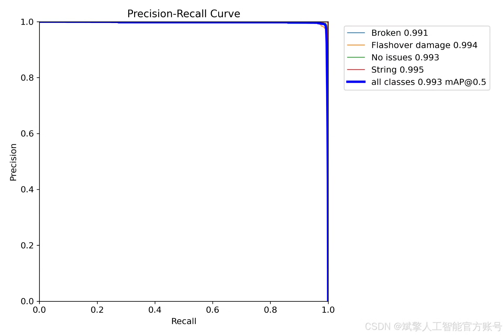
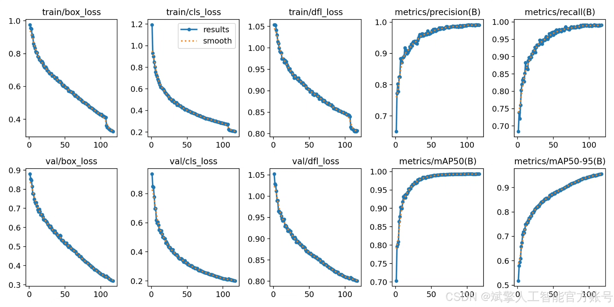
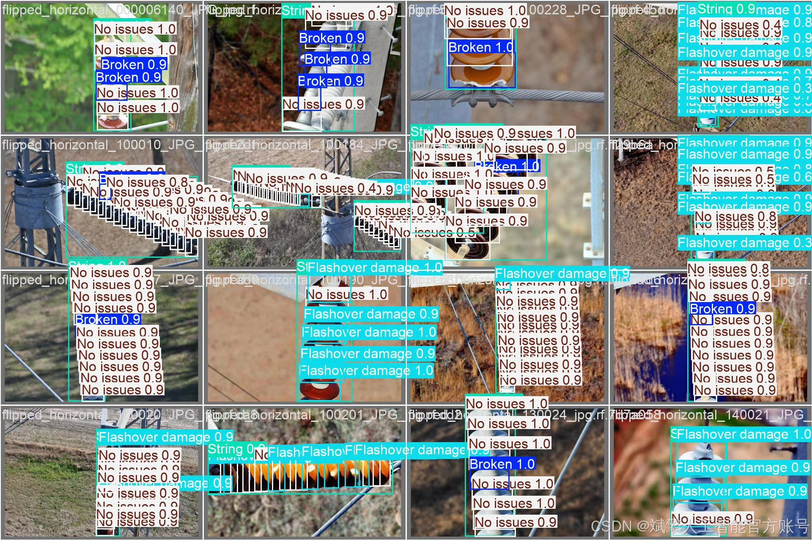

# YOLOv12 Insulator Defect Detection System

## Body

YOLOv12 Insulator Defect Detection System Based on Deep Learning YOLOv12: An Intelligent System for the Automated and Intelligent Inspection of Power Transmission Lines

This paper designs and implements a deep learning-based YOLOv12 insulator defect detection system aimed at enhancing the automation and intelligence level of power transmission line inspection. The system utilizes the latest YOLOv12 object detection model to perform high-precision recognition of insulator images containing four categories of labels (Broken, Flashover damage, No issues, String). The dataset used includes 2240 training images, 640 validation images, and 320 test images, covering various scenarios, lighting conditions, and defect types, ensuring the generalization capability of the model. To facilitate practical applications, the system integrates a visual UI interface with user login and registration functions, making it easy for maintenance personnel to quickly deploy and use. Experimental results show that the system has high detection accuracy and real-time performance on the test set, effectively assisting power departments in early discovery and maintenance decision-making of transmission equipment defects.

✅ User Login & Registration: Supports password verification and security validation.
✅ Three Detection Modes: Based on the YOLOv12 model, supporting image, video, and real-time camera detection, accurately identifying targets.
✅ Dual-Screen Comparison: Display original images and detection results on the same screen.
✅ Data Visualization: Real-time table displaying the category, confidence, and coordinates of detected targets.
✅ Intelligent Parameter Tuning: Offers a confidence slide bar to dynamically optimize detection accuracy, adapting to different scene requirements.
✅ Sci-Fi Interactive Interface: Dark theme paired with dynamic light effects, reducing visual fatigue and improving operational experience.

## Images

## Payment

Here is a pay link on Stripe ( https://buy.stripe.com/3cs8yP7sY87d0vu9AB ). Please contact me lonlonago@foxmail.com after funding $89, and I will send you a complete data files , thank you!

